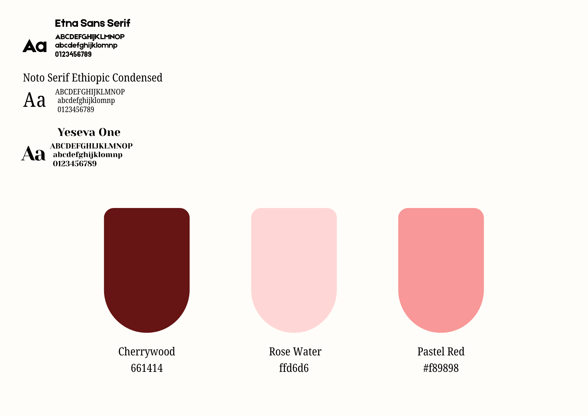

# Activity 2: Color Palette and Typography

  

## Overview

This activity focused on understanding how colors and typography can affect the appearance and effectiveness of a design.

## Concept

For this activity, I wanted to create a visual identity that feels balanced, simple, and pleasant to look at. I chose colors and fonts that work well together while keeping the information easy to read.

## Color Palette

I selected colors that complement one another and create a consistent look throughout the design. The colors were chosen not only for their appearance but also for their ability to create a specific mood and improve the overall visual balance.

I also considered contrast to make sure that the text remains readable against the background.

## Typography

For the typography, I selected fonts that are easy to read and appropriate for the purpose of the design. I used differences in font size and style to separate headings from supporting information.

The combination of fonts also helped create a visual hierarchy and made the content easier to navigate.

## What I Learned

This activity helped me understand that colors and typography are not just decorative elements. They can influence readability, mood, emphasis, and the way people perceive a design.
