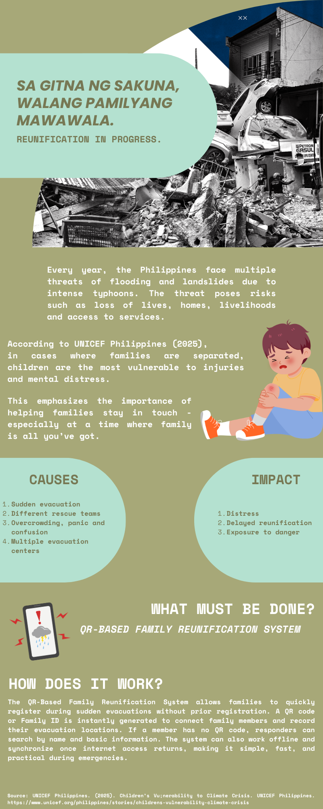

# Activity 3: Social Media Infographics and Mini Project Documentation

  

## Overview

This activity focused on creating a social media infographic and documenting the process behind its development.

## Concept

The concept was based on presenting information in a simple and visually engaging format. I wanted the infographic to communicate its message quickly while still being informative and easy to understand.

## Design Choices

I used a combination of colors, text, images, icons, and spacing to organize the information. Each element was placed with the purpose of supporting the main message rather than making the design look crowded.

## Creative Process

I started by identifying the main topic and deciding what information needed to be included. After organizing the content, I planned the layout and selected the visual elements that would support the message.

I then created the infographic using digital design tools. After completing the first version, I reviewed the design and made changes to the text, spacing, colors, and arrangement to improve the final output.

## Mini Project Documentation

The documentation presents the process and decisions involved in developing the mini project. It includes the concept, design considerations, development process, and final output.

## What I Learned

This activity helped me improve my creativity and visual communication skills. I learned that an infographic needs to balance information and design so that it remains informative while retaining appropriate design.
